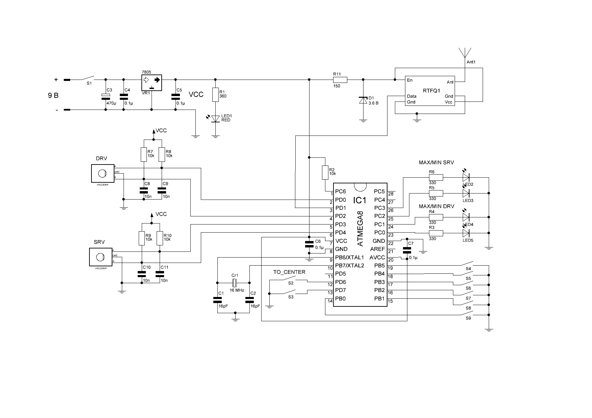
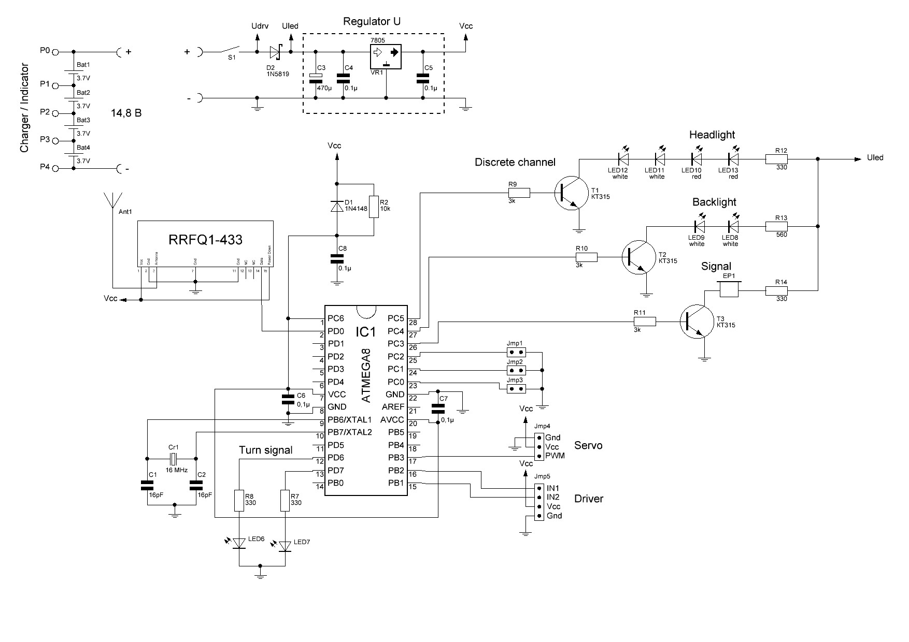

# avr-remote-control-system
Система дистанционного управления моделью на ATmega8

### Описание

Схемы передатчика и приемника дискретных и пропорциональных каналов (6 и 2 соответственно) через USART. Шифратор и дешифратор на МК ATmega8 (16 МГц). Проект выполнен в AVR Studio 4 на языке Си (кодировка файлов windows-1251).

- TX/, RX/ - проекты AVR Studio 4;
- schemas/
  * Proteus_schema.DSN, Proteus_schema.PWI - файлы Proteus для эмуляции проекта;
  * RX.spl7, TX.spl7 - схемы электрические принципиальные в sPlan 7.0.

### Схемы

Передатчик:

Приемник:

